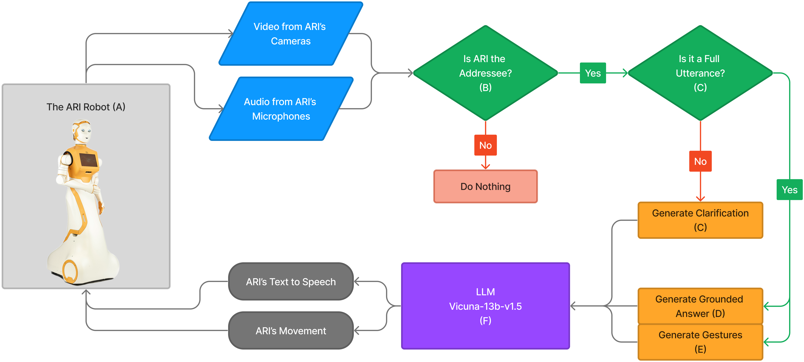

# mp-llm-demo-prompts
This repo contains the prompts used in a demo paper (under review as a non-anonymous submission). We will link the paper here if accepted. A video of the demo can be found here soon.

The architecture of our system:

To see the prompts, run `python prompts.py` or just look at the raw file.
